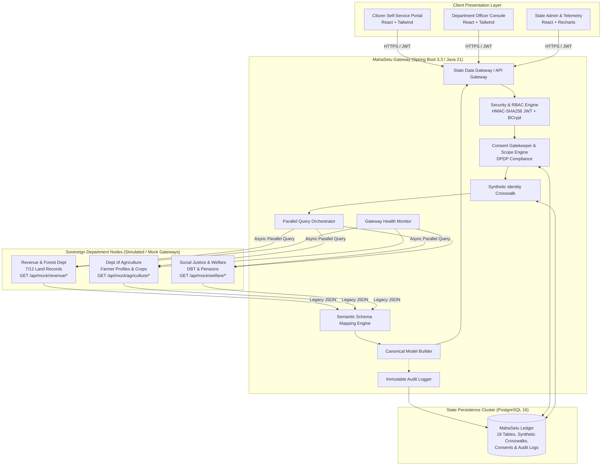
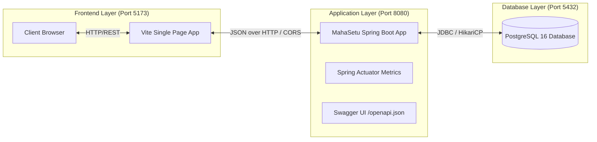

# MahaSetu (महासेतू) — System Architecture

**Government of Maharashtra State Digital Interoperability Gateway**  
**SIH26129 — Technical Architecture Specification**

---

## 1. Executive Architecture Overview

MahaSetu is designed as a **federated, zero-data-hoarding state interoperability gateway**. Rather than consolidating citizen records into a monolithic, vulnerable central database, MahaSetu orchestrates real-time, privacy-gated data exchange between sovereign departmental databases while guaranteeing:

1. **Zero Data Hoarding**: Department records remain solely inside departmental databases. MahaSetu persists only synthetic cross-references, active consent tokens, and cryptographic audit ledgers.
2. **Citizen-Centric Privacy**: Under the Digital Personal Data Protection (DPDP) principles, no officer query executes without active, scoped citizen consent.
3. **Semantic Schema Normalization**: Translates disparate departmental formats (snake_case, camelCase, nested legacy JSON) into one canonical MahaSetu standard model in memory.
4. **Fault-Tolerant High Availability**: Gracefully degrades during departmental gateway outages, returning partial records without system failure.

---

## 2. High-Level System Architecture Diagram

---

## 3. Core Architectural Principles

### 3.1. Zero-Data-Hoarding Principle
MahaSetu **never permanently stores** land records, crop data, or welfare disbursement details. It maintains only:
- A synthetic master citizen crosswalk (`MH-CIT-10001` $\rightarrow$ `REV-7-12-001`, `AGR-FARM-001`, `WEL-BEN-001`).
- Active citizen consents and permitted data scopes.
- Immutable audit ledger entries.

### 3.2. Stateless Security Architecture
All requests are verified statelessly using JSON Web Tokens (JJWT) signed with HMAC-SHA256. Role-Based Access Control (RBAC) is enforced at both the HTTP security filter chain and method-level security (`@PreAuthorize`).

### 3.3. Parallel Query Orchestration
When an authorized officer submits an interoperability request, MahaSetu dispatches parallel asynchronous HTTP calls to the selected departmental gateways. If one department is offline (e.g. during an outage), MahaSetu captures the failure, collects available data from healthy departments, and returns a structured `PARTIAL_SUCCESS` canonical response.

---

## 4. Network and Deployment Topology

