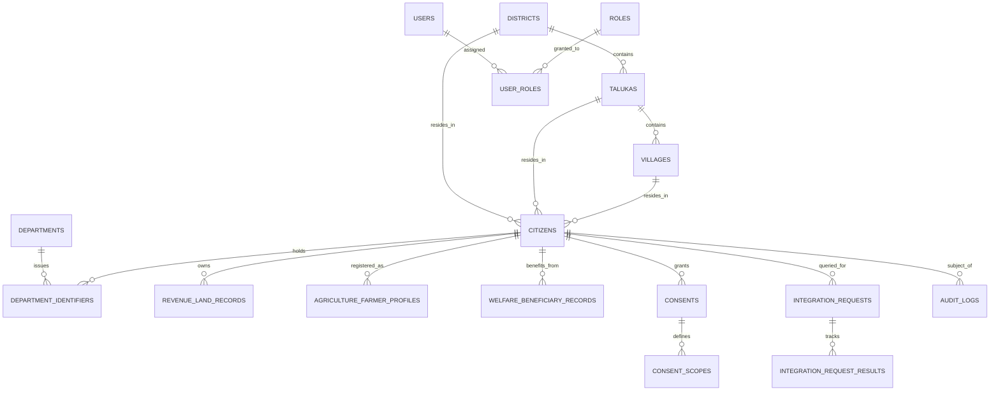

# MahaSetu (महासेतू) — Database Design & Data Dictionary

**Government of Maharashtra State Digital Interoperability Platform**  
**SIH26129 — Database Schema & Architecture Specification**

---

## 1. Database Architecture Overview

MahaSetu utilizes **PostgreSQL 16** as its persistence cluster. The schema is organized into 6 functional domains comprising **19 tables** designed with strict referential integrity, foreign key cascades, unique constraints, and B-Tree indexes for sub-millisecond lookups.

---

## 2. Table Specifications by Domain

### 2.1. Administrative Hierarchy
1. `districts`: 10 administrative divisions across Maharashtra (e.g. Pune, Nagpur, Nashik, Aurangabad, etc.).
2. `talukas`: Sub-districts linked via `district_id`.
3. `villages`: Gram panchayats and census villages with verified postal codes.

### 2.2. Master Citizen Synthetic Registry
4. `citizens`: Zero-PII synthetic master citizen profiles (`MH-CIT-10001` through `MH-CIT-10050`) containing synthetic names, date of birth, masked phone, masked email, and residential village reference.

### 2.3. Federated Department Identity Crosswalk
5. `departments`: Sovereign state department nodes (`REV` - Revenue & Forest, `AGR` - Agriculture, `WEL` - Social Justice & Welfare).
6. `department_identifiers`: Cross-departmental synthetic identifier mapping table resolving legacy IDs (e.g. `MH-REV-KH-10001`, `MH-AGR-REG-10001`, `MH-WEL-BR-10001`) to the central citizen identity without revealing internal departmental keys.

### 2.4. Sovereign Departmental Data Holdings (Mock Nodes)
7. `revenue_land_records`: 7/12 land records including survey numbers (`survey_number`), gat numbers, khata numbers, total area in hectares, cultivable area, land types (`BAGAYAT`, `JIRAIT`, `TARI`), and encumbrance status.
8. `agriculture_farmer_profiles`: Farmer registration profiles, categories (`MARGINAL`, `SMALL`, `SEMI_MEDIUM`, `LARGE`), primary and secondary crops, soil types, and subsidy utilization history.
9. `welfare_beneficiary_records`: Direct Benefit Transfer (DBT) scheme enrollments (`scheme_name`, `scheme_code`), beneficiary categories, monthly stipends in INR, masked bank account numbers, and disbursement audit flags.

### 2.5. Platform Service Registry & Schema Engine
10. `services`: Catalog of registered microservices, endpoints (`endpoint_path`), HTTP methods, and SLA thresholds.
11. `schema_mappings`: Semantic field transformation rules mapping legacy departmental JSON structures to standard canonical models.

### 2.6. Identity, Security & RBAC
12. `roles`: Platform authority roles (`ROLE_ADMIN`, `ROLE_DEPARTMENT_OFFICER`, `ROLE_CITIZEN`, `ROLE_SYSTEM`).
13. `users`: Authentication accounts with BCrypt-hashed credentials (12 rounds) and departmental affiliation.
14. `user_roles`: Many-to-many role assignments.

### 2.7. Request Orchestration & Privacy Compliance
15. `integration_requests`: Correlation tracking for federated query requests (`request_id`, `citizen_id`, `purpose`, `status`).
16. `integration_request_results`: Per-department execution telemetry (response times, statuses, error codes).
17. `consents`: Citizen-granted data-sharing permissions with requesting department, purpose, validity window, and cryptographic revocation timestamps.
18. `consent_scopes`: Data scopes authorized per consent agreement (`IDENTITY`, `LOCATION`, `LAND`, `AGRICULTURE`, `WELFARE`).
19. `audit_logs`: Immutable compliance audit trail capturing every officer query with timestamps, user identity, purpose, and execution latencies.

---

## 3. Database Indexing Strategy

To guarantee high throughput and sub-50ms SLA response times, the following B-Tree indexes are deployed:

| Index Name | Table | Columns | Purpose |
| :--- | :--- | :--- | :--- |
| `idx_citizens_citizen_id` | `citizens` | `citizen_id` | Fast synthetic ID lookup |
| `idx_dept_ident_citizen` | `department_identifiers` | `citizen_id` | Identity crosswalk resolution |
| `idx_rev_land_citizen` | `revenue_land_records` | `citizen_id` | 7/12 Land extract queries |
| `idx_agr_farmer_citizen` | `agriculture_farmer_profiles` | `citizen_id` | Farmer profile queries |
| `idx_wel_beneficiary_citizen` | `welfare_beneficiary_records` | `citizen_id` | DBT scheme queries |
| `idx_consents_citizen` | `consents` | `citizen_id, status` | Real-time consent gatekeeping |
| `idx_audit_logs_timestamp` | `audit_logs` | `timestamp DESC` | High-speed audit telemetry display |
