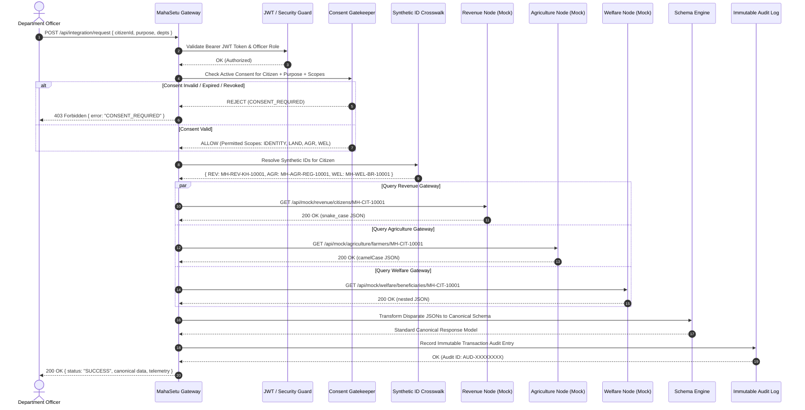
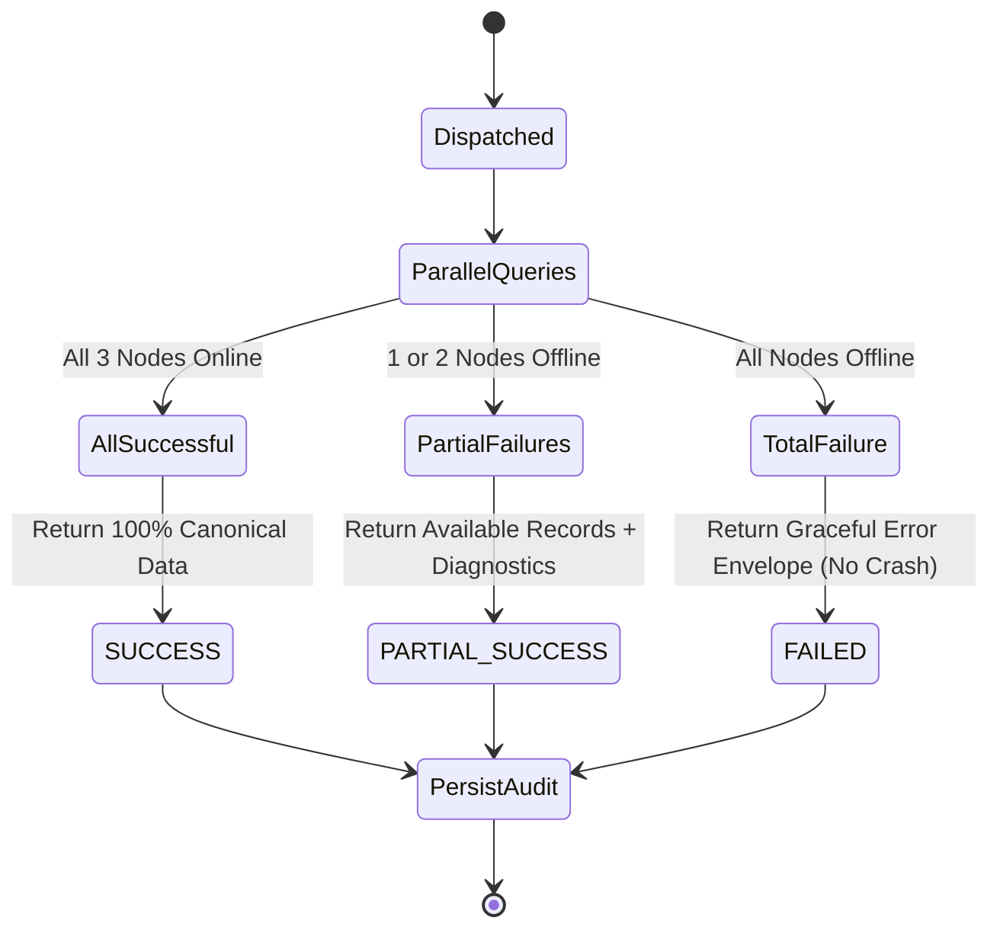

# MahaSetu (महासेतू) — Integration Lifecycle & Orchestration

**Government of Maharashtra State Digital Interoperability Platform**  
**SIH26129 — Request Orchestration Specification**

---

## 1. Federated Integration Lifecycle Sequence Diagram

---

## 2. Fault Tolerance & Outage Failover Orchestration

MahaSetu implements resilient failover logic to prevent cascading system failures:

### Outage Handling Rules:
1. **Single Department Outage** (e.g. Agriculture Gateway Offline):
   - Revenue returns `SUCCESS` (Land records available).
   - Agriculture returns `OFFLINE FAILOVER` (`503 Service Unavailable` simulated).
   - Welfare returns `SUCCESS` (DBT benefits available).
   - Overall Request Status: `PARTIAL_SUCCESS`.
   - Result: Officer receives Land and Welfare records with a clear status badge that Agriculture is undergoing a temporary outage.
2. **Total Gateway Outage** (All 3 departments offline):
   - Handled gracefully with overall status `FAILED` and error diagnostics. The system **never crashes** with an unhandled 500 error.
