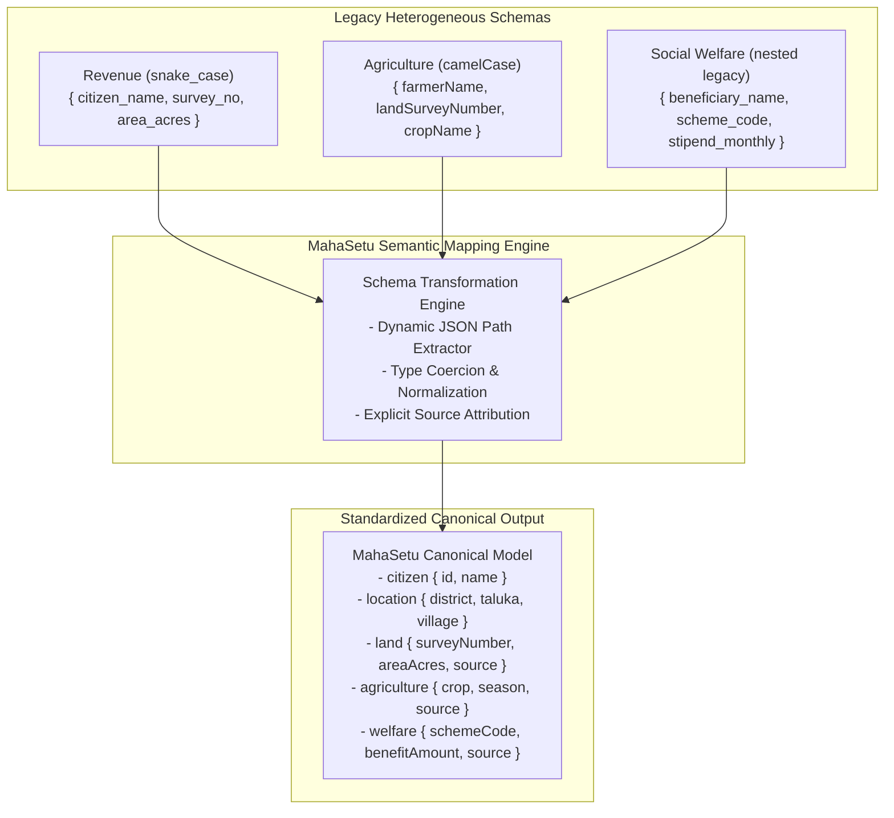

# MahaSetu (महासेतू) — Schema Mapping & Canonical Data Model

**Government of Maharashtra State Digital Interoperability Platform**  
**SIH26129 — Semantic Transformation Engine Specification**

---

## 1. The Interoperability Challenge: Disparate Departmental Formats

Legacy government departmental IT systems evolved independently over decades, resulting in conflicting naming conventions, data types, and nesting:



---

## 2. Standard MahaSetu Canonical Data Model

Every federated query is transformed in-memory into the unified MahaSetu Canonical Response:

```json
{
  "requestId": "REQ-7B93AC12",
  "citizenId": "MH-CIT-10001",
  "status": "SUCCESS",
  "purpose": "SUBSIDY_VERIFICATION",
  "requestingUser": "officer.revenue",
  "citizen": {
    "id": "MH-CIT-10001",
    "name": "Ramesh Tukaram Shinde"
  },
  "location": {
    "district": "Pune",
    "taluka": "Haveli",
    "village": "Wagholi"
  },
  "land": {
    "surveyNumber": "SN-101",
    "areaAcres": 1.98,
    "source": "REVENUE"
  },
  "agriculture": {
    "crop": "Cotton",
    "season": "Kharif",
    "landUsage": "BAGAYAT",
    "source": "AGRICULTURE"
  },
  "welfare": {
    "schemeCode": "SGN-01",
    "schemeName": "Sanjay Gandhi Niradhar",
    "benefitAmount": 1500.00,
    "applicationStatus": "PROCESSED",
    "source": "WELFARE"
  },
  "sources": ["REVENUE", "AGRICULTURE", "WELFARE"],
  "departmentResponses": [
    { "department": "REVENUE", "status": "SUCCESS", "responseTimeMs": 18 },
    { "department": "AGRICULTURE", "status": "SUCCESS", "responseTimeMs": 22 },
    { "department": "WELFARE", "status": "SUCCESS", "responseTimeMs": 19 }
  ],
  "totalLatencyMs": 35,
  "createdAt": "2026-08-28T13:00:00Z",
  "completedAt": "2026-08-28T13:00:00.035Z"
}
```

---

## 3. Dynamic Transformation Rules

The platform maintains configurable transformation rules in the `schema_mappings` repository:

| Department | Source Field | Target Canonical Field | Data Type | Transformation Action |
| :--- | :--- | :--- | :--- | :--- |
| **Revenue** | `citizen_name` | `citizen.name` | `STRING` | Direct field extraction |
| **Revenue** | `survey_no` | `land.surveyNumber` | `STRING` | String trim & uppercase |
| **Revenue** | `area_acres` | `land.areaAcres` | `DOUBLE` | Float/Double conversion |
| **Revenue** | `village_name` | `location.village` | `STRING` | Capitalization standard |
| **Agriculture** | `farmerName` | `citizen.name` | `STRING` | Fallback attribution |
| **Agriculture** | `landSurveyNumber` | `land.surveyNumber` | `STRING` | Cross-verification check |
| **Agriculture** | `cropName` | `agriculture.crop` | `STRING` | Standardization |
| **Agriculture** | `cropSeason` | `agriculture.season` | `STRING` | Normalization |
| **Social Welfare** | `beneficiary_name` | `citizen.name` | `STRING` | Fallback attribution |
| **Social Welfare** | `scheme_code` | `welfare.schemeCode` | `STRING` | Uppercase formatting |
| **Social Welfare** | `stipend_monthly` | `welfare.benefitAmount` | `DOUBLE` | Currency conversion |
