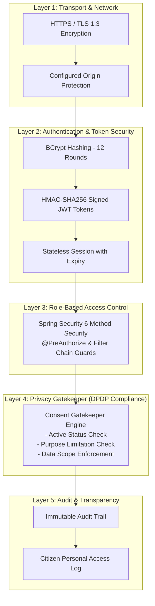

# MahaSetu (महासेतू) — Security Architecture & DPDP Compliance

**Government of Maharashtra State Digital Interoperability Platform**  
**SIH26129 — Platform Security & Data Protection Specification**

---

## 1. Security Architecture Summary

MahaSetu implements **Defense-in-Depth** across all network, transport, application, and persistence layers:

---

## 2. Role-Based Access Control (RBAC) Matrix

| Endpoint Group | `ROLE_ADMIN` | `ROLE_DEPARTMENT_OFFICER` | `ROLE_CITIZEN` | Public |
| :--- | :---: | :---: | :---: | :---: |
| `POST /api/auth/login` | :white_check_mark: | :white_check_mark: | :white_check_mark: | :white_check_mark: |
| `GET /api/health` | :white_check_mark: | :white_check_mark: | :white_check_mark: | :white_check_mark: |
| `POST /api/integration/request` | :white_check_mark: | :white_check_mark: | :x: | :x: |
| `GET /api/citizen/profile` | :white_check_mark: | :x: | :white_check_mark: | :x: |
| `POST /api/consents` | :white_check_mark: | :white_check_mark: | :white_check_mark: | :x: |
| `PUT /api/consents/{id}/revoke` | :white_check_mark: | :x: | :white_check_mark: | :x: |
| `GET /api/citizen/data-access` | :white_check_mark: | :x: | :white_check_mark: | :x: |
| `GET /api/stats` | :white_check_mark: | :x: | :x: | :x: |
| `GET /api/audit-logs` | :white_check_mark: | :x: | :x: | :x: |
| `PUT /api/mock/admin/departments/{code}/status` | :white_check_mark: | :x: | :x: | :x: |

---

## 3. Privacy & DPDP Compliance Enforcement

1. **Explicit Purpose Limitation**: Every query must declare an authorized purpose (e.g. `SUBSIDY_VERIFICATION`, `DIRECT_BENEFIT_TRANSFER`). If the purpose is unauthorized or not covered by the citizen's consent, the query is blocked with HTTP 403 `CONSENT_REQUIRED`.
2. **Granular Data Scope Minimization**: Consents are bound to specific scopes (`IDENTITY`, `LOCATION`, `LAND`, `AGRICULTURE`, `WELFARE`). Officers cannot request data outside approved scopes.
3. **Instant Revocability**: Citizens can revoke active consent at any moment via the Citizen Portal. Revocation takes effect in real-time.
4. **Transparent Citizen Access Logs**: Citizens can view every instance of government officer access to their data via `GET /api/citizen/data-access`.

---

## 4. Security Audit & Hardening Verification

- [x] **No Secrets in Source Code**: Database credentials and JWT secrets use environment variables with fallback defaults.
- [x] **No Tokens or Passwords in Logs**: Log outputs sanitize authorization headers and credential parameters.
- [x] **Masked Stack Traces**: All unhandled or application exceptions return normalized JSON envelopes (`ErrorResponse`) without revealing server internal stack traces.
- [x] **SQL Injection Defense**: Built on Spring Data JPA and Hibernate with parameterized query execution.
- [x] **Cross-Origin Resource Sharing (CORS)**: Strict origin whitelisting allowing only authorized client origins.
