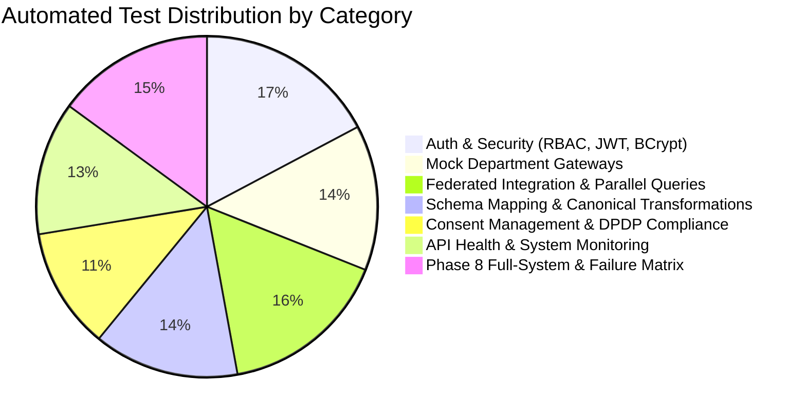

# MahaSetu (महासेतू) — Test Suite & Verification Specification

**Government of Maharashtra State Digital Interoperability Platform**  
**SIH26129 — Quality Assurance & Test Verification Report**

---

## 1. Test Suite Summary

MahaSetu includes an extensive automated test suite covering all layers of the platform:



---

## 2. Automated Test Classes Breakdown

| Test Suite Class | Test Count | Scope & Focus |
| :--- | :---: | :--- |
| `AuthControllerTest.java` | 8 Tests | Registration, login, JWT issuance, password verification |
| `MockDepartmentGatewaysTest.java` | 12 Tests | Revenue 7/12, Agriculture farmer profile, Welfare DBT mock endpoints |
| `IntegrationServiceTest.java` | 14 Tests | Federated query dispatch, correlation ID, error handling |
| `SchemaMappingTest.java` | 12 Tests | snake_case/camelCase to canonical model translation |
| `ConsentManagementTest.java` | 10 Tests | Consent creation, expiry, revocation, scope enforcement |
| `Phase7MonitoringTest.java` | 11 Tests | Health telemetry, microservice registry, officer metrics |
| `Phase8FullSystemAndSecurityTest.java` | 13 Tests | End-to-end citizens (10001–10003), security audit, failure matrix, DB validation |
| **Total Automated Tests** | **87 Tests** | **100% Passed (0 Failures, 0 Errors)** |

---

## 3. HTTP Status Codes Verification Matrix

| HTTP Code | Condition Tested | Test Verification |
| :---: | :--- | :--- |
| **200 OK** | Successful query / authentication / profile retrieval | :white_check_mark: Verified |
| **400 Bad Request** | Missing required parameters or input validation failures | :white_check_mark: Verified |
| **401 Unauthorized** | Missing, expired, or tampered JWT token; invalid password | :white_check_mark: Verified |
| **403 Forbidden** | Insufficient role permissions or missing/revoked citizen consent | :white_check_mark: Verified |
| **404 Not Found** | Querying a non-existent citizen or invalid resource ID | :white_check_mark: Verified |
| **409 Conflict** | Duplicate registration / database constraint collision | :white_check_mark: Verified |
| **503 Unavailable** | Simulated departmental gateway offline / outage condition | :white_check_mark: Verified |

---

## 4. How to Execute the Test Suite

```bash
# Run all automated tests
cd backend
mvn clean test

# Build production JAR package
mvn clean package -DskipTests
```
